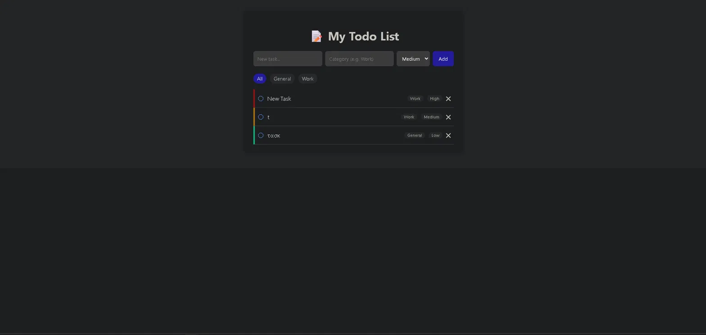

# Day 89 — Todo List App

A simple but feature-rich todo list web app built with Flask, SQLAlchemy, and Jinja2 — part of the 100 Days of Code Python bootcamp.

## Screenshot



*(Add a screenshot of the running app here — see "How to add a screenshot" below)*

## Features

- Add tasks with a title, category, and priority (Low / Medium / High)
- Mark tasks as done / not done with a single click
- Delete tasks
- Filter tasks by category
- Tasks are automatically sorted: incomplete tasks first, then by priority
- Color-coded priority indicator on each task

## Tech Stack

- **Flask** — web framework
- **Flask-SQLAlchemy** — ORM for database access
- **SQLite** — lightweight file-based database
- **Jinja2** — templating engine (built into Flask)

## How to Run Locally

1. Clone the repo and navigate to this folder:
   ```bash
   git clone https://github.com/StamatisKamisakis/udemy-100-days-of-code.git
   cd "udemy-100-days-of-code/Day 89"
   ```

2. Install dependencies:
   ```bash
   pip install -r requirements.txt
   ```

3. Run the app:
   ```bash
   python app.py
   ```

4. Open your browser at `http://127.0.0.1:5000`

The database file (`todos.db`) is created automatically on first run.

## How to Add a Screenshot

1. Run the app locally (steps above)
2. Add a few sample tasks so the screenshot looks populated
3. Take a screenshot of the browser window
4. Save it as `screenshot.png` in this same folder
5. Commit and push — it will automatically appear at the top of this README

## Project Structure

```
Day 89/
├── app.py              # Flask app: routes and database model
├── requirements.txt    # Python dependencies
├── templates/
│   └── index.html      # Main page template
└── static/
    └── style.css        # Styling
```

## Reflection

*(Add your own notes here: how you approached the project, what was hard, what was easy, what you'd do differently next time.)*